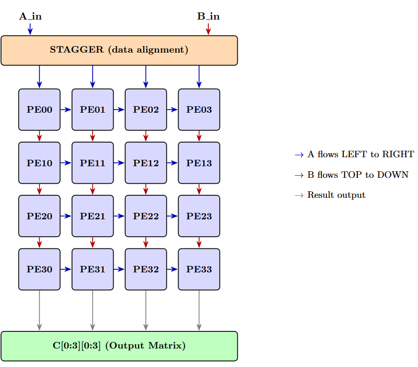
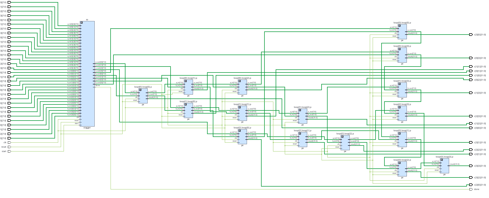
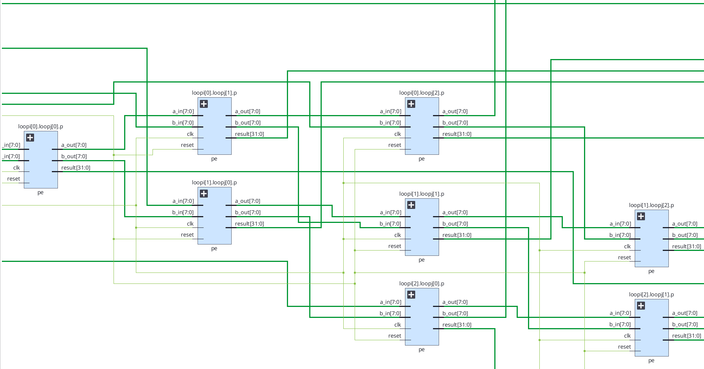
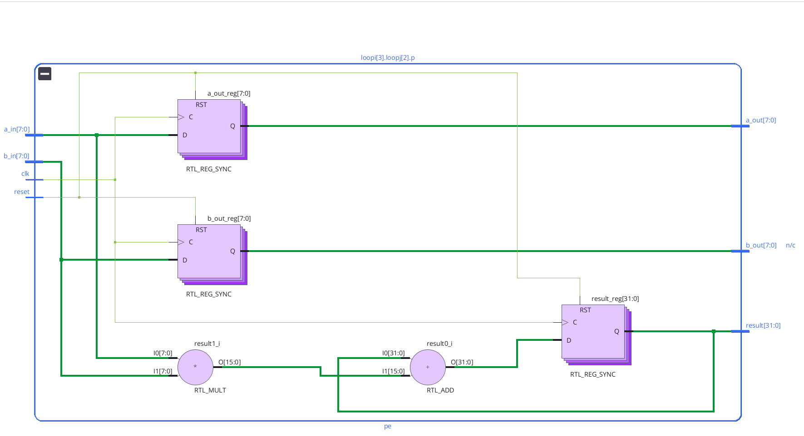
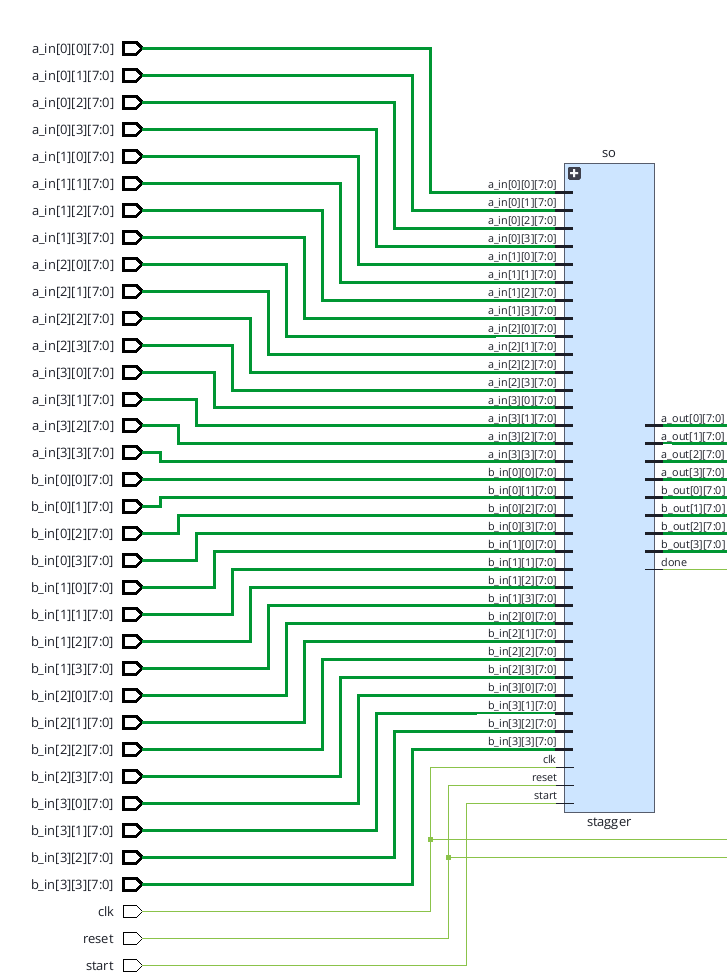
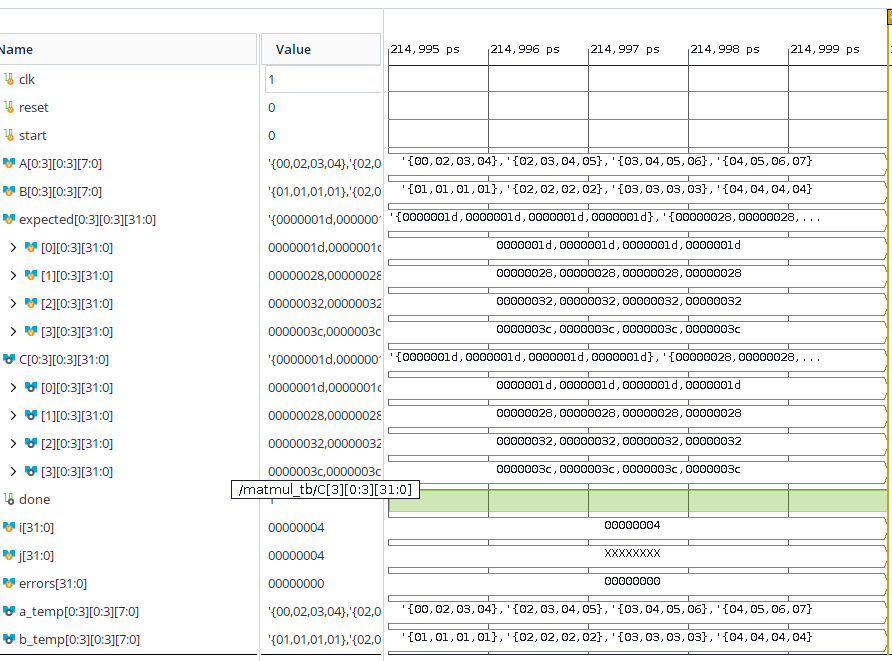

# nano-tpu

A 4×4 systolic array accelerator for matrix multiplication in Verilog/SystemVerilog, targeting the Xilinx Artix-7 FPGA (xc7a100tcsg324-1).

Inspired by Google's TPU architecture. Built as a portfolio project exploring hardware acceleration for AI workloads.

---

## Motivation

AI inference spends ~90% of its compute in matrix multiplication. General-purpose CPUs waste energy on control overhead for this regular workload. Systolic arrays — grids of simple MAC units with local data movement — achieve near-optimal efficiency by eliminating instruction fetch, maximizing data reuse, and running massively parallel MACs on dedicated hardware.

This project implements a 4×4 systolic array as a foundation for larger AI accelerators.

---

## Architecture
### Block Diagram




### Dataflow

- **A rows flow LEFT → RIGHT** through the array
- **B columns flow TOP → DOWN** through the array
- Each PE accumulates one output: `C[i][j] = Σ A[i][k] × B[k][j]`
- **Output-stationary** — results stay in the PE that computed them
- **7-cycle compute latency** for a 4×4 matrix multiply

### Design Decisions

| Choice | Rationale |
|---|---|
| Output-stationary | Simpler PE design, avoids partial-sum routing |
| 8-bit inputs | Standard for INT8 quantized neural networks |
| 32-bit accumulator | Prevents overflow; supports future extension to convolution (deep accumulation) |
| Registered pass-through in PE | Classic TPU-style; improves timing at cost of 1-cycle propagation delay per hop |
| No separate controller | Stagger self-times the array via data flow, following TPU pattern |

---

## Implementation

### Full Elaborated Schematic



Vivado elaboration of the 4×4 array with stagger. The 16 PE instances are generated from a nested `generate` block. Green buses carry 8-bit A/B data; thin lines carry clock and reset globally.

### Processing Element



Each PE exposes `a_in`, `b_in`, `a_out`, `b_out`, `result`, `clk`, `reset`. Internally it performs one MAC per cycle and passes operands to its right/down neighbors on the next clock edge.

### PE Internals



Vivado-synthesized PE showing the multiplier (`RTL_MULT`) and pass-through registers (`RTL_REG_SYNC`). All 16 PEs share this identical structure.

### Stagger Module



Feeds input rows of A and columns of B into the array with the diagonal skew required by the systolic dataflow. Runs a 7-cycle FSM controlled by `start` and asserts `done` when computation completes.

---

## Verification

### Testbench

Dense matrix test with hand-verified expected values and per-cell PASS/FAIL reporting:

A = [1 2 3 4] B = [1 1 1 1]
[2 3 4 5] [2 2 2 2]
[3 4 5 6] [3 3 3 3]
[4 5 6 7] [4 4 4 4]

Expected C = A × B = [30 30 30 30]
[40 40 40 40]
[50 50 50 50]
[60 60 60 60]

text


Dense values exercise every PE (identity-matrix tests only verify the diagonal).

### Waveform



### Status

- ✅ Synthesizes cleanly on Xilinx Artix-7
- ✅ 15 of 16 PEs verified correct with dense matrix test
- 🔨 Investigating edge case affecting C[0][0]
- 📋 DSP48E1 inference optimization pending
- 📋 Top-level FPGA I/O module pending

---

## Resource Utilization

Synthesized in Vivado 2023.2 for xc7a100tcsg324-1:

| Resource | Per PE | Total (16 PEs + stagger) | % of Artix-7 |
|---|---|---|---|
| Slice LUTs | ~85 | ~1,700 | 2.7% |
| Slice Registers | ~48 | ~1,000 | 0.8% |
| DSP48E1 | 0 (LUT-based) | 0 | 0% |

Multipliers are currently synthesized as LUT logic. Forcing DSP48E1 inference is expected to reduce LUT usage by ~50% and improve timing — pending optimization.

---

## File Structure

```
nano-tpu/
├── README.md
├── LICENSE
├── .gitignore
├── rtl/
│   ├── pe.v            — Processing Element (Verilog)
│   ├── stagger.sv      — Input staggering FSM (SystemVerilog)
│   └── systolic.sv     — 4×4 array top module (SystemVerilog)
├── tb/
│   └── test_bench.v    — Verification testbench with PASS/FAIL check
└── docs/
    └── images/         — Schematics and waveforms
```


---

## Tools

- HDL: Verilog, SystemVerilog
- Simulation & Synthesis: Xilinx Vivado 2023.2
- Target FPGA: Xilinx Artix-7 (xc7a100tcsg324-1)
- Verification: Python NumPy (golden reference)
- OS: Ubuntu 22.04 (WSL2)

---

## Roadmap

**Short-term**
- [ ] Resolve C[0][0] edge case error with A00
- [ ] Force DSP48E1 inference
- [ ] Add top-level FPGA I/O module
- [ ] Add BRAM-based weight/input buffers

**Medium-term**
- [ ] Extend to convolution 
- [ ] Add ReLU activation unit
- [ ] Integrate with a small RISC-V core for control
- [ ] Deploy on physical FPGA board

**Long-term**
- [ ] Scale to 8×8 and 16×16 arrays
- [ ] INT8 quantization support
- [ ] Compare against PULP Platform accelerators

---

## Related Work

- **[fundamental](https://github.com/rhythm99e/fundamental)** — Single-cycle RISC-V RV32I processor in Verilog

## References

- Jouppi et al., ["In-Datacenter Performance Analysis of a Tensor Processing Unit"](https://arxiv.org/abs/1704.04760)
- Harris & Harris, *Digital Design and Computer Architecture* (RISC-V Edition)
- [PULP Platform](https://github.com/pulp-platform)
- [Onur Mutlu lectures](https://www.youtube.com/@OnurMutluLectures)

---

## Author

**Rhythm Katwal**  
Electronics and Communication Engineering  
Pulchowk Campus, IOE, Tribhuvan University, Nepal  
GitHub: [@rhythm99e](https://github.com/rhythm99e)

## License

MIT — see [LICENSE](LICENSE).